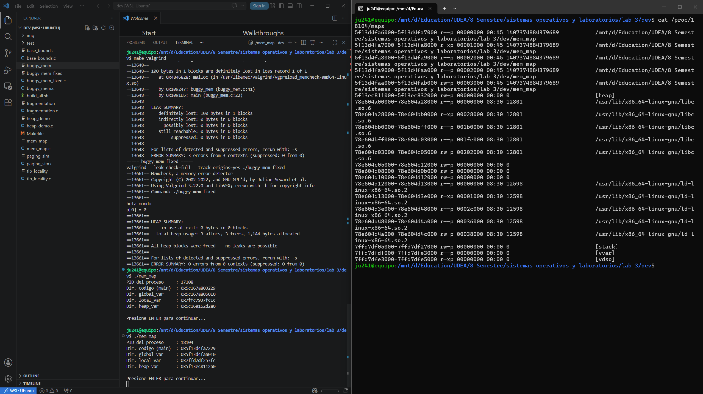
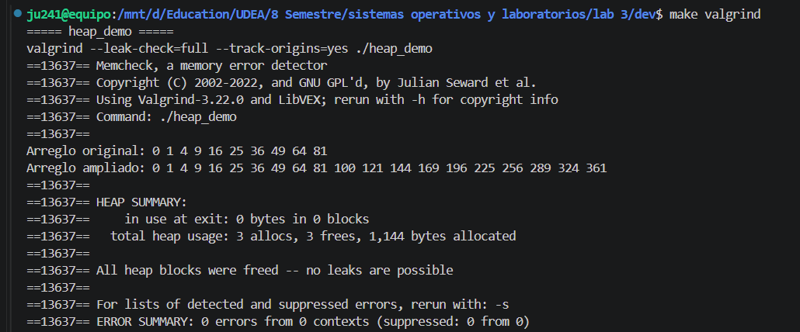
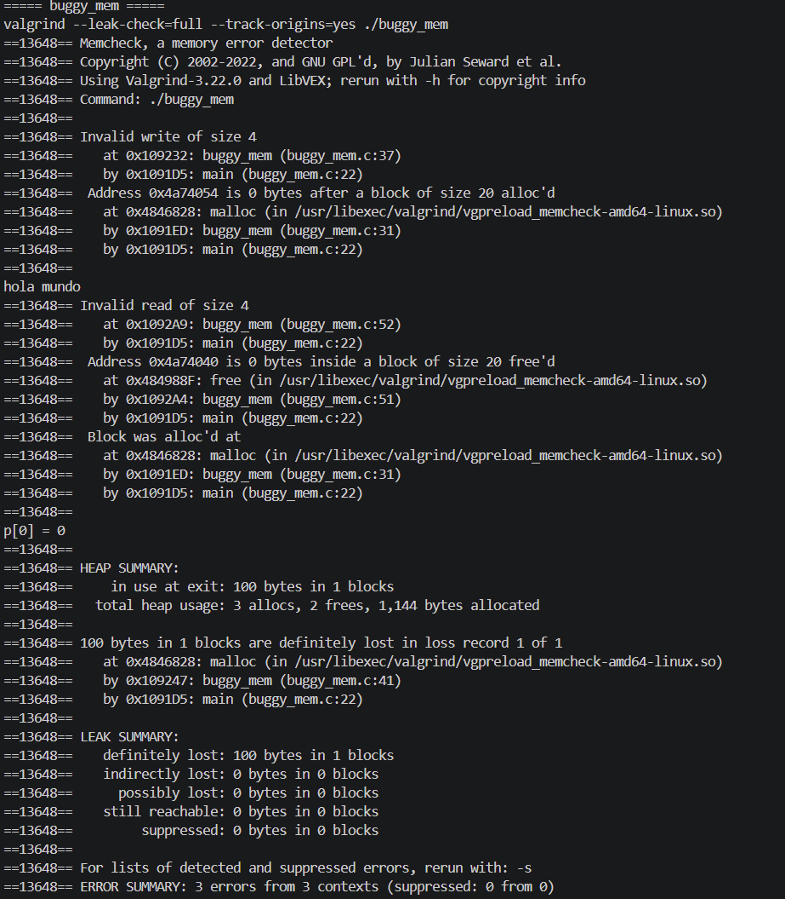
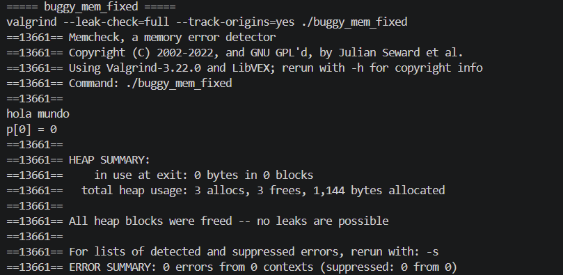
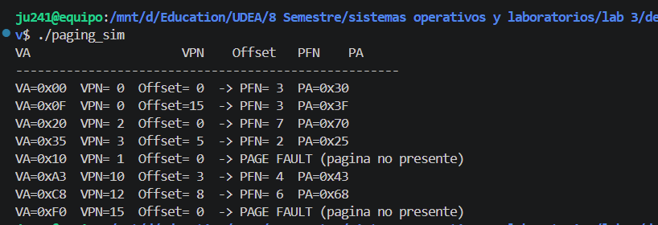
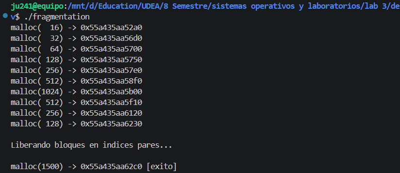
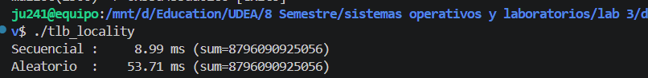
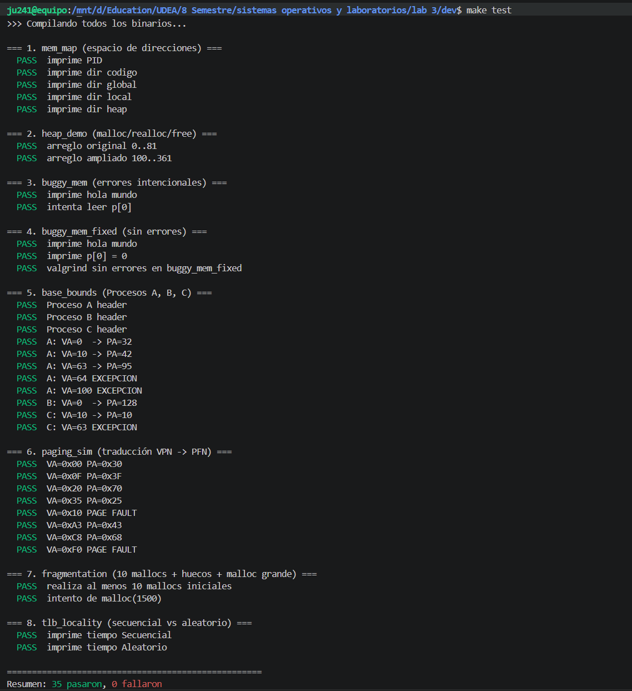

# Práctica No. 3: Gestión de Memoria

**Juan Pablo Cardona Aristizabal**
juan.cardona59@udea.edu.co — 1.041.204.949

**Cristian Alberto Agudelo Marquez**
cristian.agudelo1@udea.edu.co — 1.041.268.267

[2554842] SIST. OPERAT. Y LAB.
Johnny Alexander Aguirre Morales

**UNIVERSIDAD DE ANTIOQUIA**
Facultad de Ingeniería — Ingeniería de Sistemas
Laboratorio de Sistemas Operativos — 2026

---

# 1. Introducción

La práctica explora empíricamente cómo el sistema operativo construye, para cada proceso, la abstracción de un **espacio de direcciones virtual privado** y cómo lo traduce a memoria física mediante mecanismos de complejidad creciente: base & bounds, segmentación, paginación y TLB. Adicionalmente se estudia el manejo de memoria dinámica con la API `malloc/free/realloc`, sus errores típicos (buffer overflow, memory leak, double free, use-after-free) y la gestión del espacio libre dentro del heap.

Se entregan **7 programas en C** (uno por sección) más una versión arreglada del programa con bugs intencionales. Todos compilan con `gcc -Wall -Wextra -std=c99 -g`, fueron ejecutados en Ubuntu 24 / WSL sobre Windows 11, validados con un banco automatizado de **35 casos de prueba** (`make test`) y con `Valgrind 3.22.0` (`make valgrind`).

---

# 2. Estructura del repositorio

```
lab 3/
├── README.md                 (este informe)
├── GUION_VIDEO.md            (guion de la sustentación)
├── 03-Memoria2.pdf           (enunciado oficial)
└── dev/
    ├── Makefile              (compila los 7+1 binarios; targets: all, test, valgrind, clean)
    ├── build_all.sh          (alternativa sin make)
    ├── mem_map.c             (Sección 1: espacio de direcciones)
    ├── heap_demo.c           (Sección 2: API correcto malloc/realloc/free)
    ├── buggy_mem.c           (Sección 2: tres errores intencionales)
    ├── buggy_mem_fixed.c     (Sección 2: versión corregida)
    ├── base_bounds.c         (Sección 3: traducción base & bounds + Proceso C)
    ├── paging_sim.c          (Sección 5: simulador de paginación)
    ├── fragmentation.c       (Sección 6: fragmentación con malloc/glibc)
    ├── tlb_locality.c        (Sección 7: secuencial vs aleatorio)
    ├── test/
    │   ├── test_lab3.sh      (35 casos automatizados)
    │   ├── capture_maps.sh   (captura /proc/PID/maps de mem_map)
    │   └── salidas.md        (evidencia de ejecuciones reales)
    └── img/                  (capturas para el informe)
```

Para compilar y ejecutar todas las pruebas:

```bash
cd "lab 3/dev"
make all && make test       # 35/35 casos deben pasar
make valgrind                # Valgrind sobre los 3 programas de la seccion 2
```

---

# 3. Documentación de funciones

A continuación se documenta cada función desarrollada en los 8 archivos `.c`.

| Programa            | Función / Rutina                       | Propósito                                                                                                     | Retorno / Efecto |
| :------------------ | :------------------------------------- | :------------------------------------------------------------------------------------------------------------ | :--------------- |
| `mem_map.c`         | `main()`                               | Punto de entrada. Delega en `mem_map()` para mantener `main` corto.                                           | int              |
| `mem_map.c`         | `mem_map()`                            | Reserva 100 ints en heap, declara una local en stack e imprime las direcciones de las cuatro regiones (código, .data, stack, heap) junto con el PID. Espera ENTER para permitir inspeccionar `/proc/[pid]/maps`. | int (0 ok) |
| `heap_demo.c`       | `main()`                               | Delega en `heap_demo()`.                                                                                      | int              |
| `heap_demo.c`       | `heap_demo()`                          | Reserva un arreglo de 10 ints, lo amplía a 20 con `realloc` y lo libera. Maneja correctamente los retornos de `malloc`/`realloc` y libera todo. | int (0 ok) |
| `buggy_mem.c`       | `main()`                               | Delega en `buggy_mem()`.                                                                                      | int              |
| `buggy_mem.c`       | `buggy_mem()`                          | Programa con tres errores intencionales: buffer overflow (`p[5]`), memory leak (no se libera `q`) y use-after-free (`p[0]` tras `free`). Sirve para que Valgrind los reporte. | int |
| `buggy_mem_fixed.c` | `main()`                               | Delega en `buggy_mem_fixed()`.                                                                                | int              |
| `buggy_mem_fixed.c` | `buggy_mem_fixed()`                    | Versión corregida del anterior: itera con `i < 5`, libera `q` y mueve el `printf("p[0]…")` antes de `free(p)`. Asigna `NULL` después de cada free. | int (0 ok) |
| `base_bounds.c`     | `main()`                               | Delega en `base_bounds()`.                                                                                    | int              |
| `base_bounds.c`     | `traducir(r, va)`                      | Calcula `PA = base + va` validando `0 ≤ va < bounds`. Si la VA está fuera de rango imprime una excepción y devuelve `-1`. Modela lo que haría la MMU. | int |
| `base_bounds.c`     | `probar_proceso(nombre, r, vas, n)`    | Recorre un arreglo de VAs e imprime la traducción para el proceso indicado. Factoriza el bucle común a A, B y C. | void          |
| `base_bounds.c`     | `base_bounds()`                        | Define los procesos A (32, 64), B (128, 80) y C (0, 32) y los prueba con `{0, 10, 63, 64, 100}`.              | int (0)          |
| `paging_sim.c`      | `main()`                               | Delega en `paging_sim()`.                                                                                     | int              |
| `paging_sim.c`      | `traducir(va)`                         | Descompone la VA de 8 bits en VPN (4 bits altos) y offset (4 bits bajos), consulta `page_table[vpn]` y, si la página está presente, imprime `PA = (PFN<<4) | offset`. Si no, imprime `PAGE FAULT`. | void |
| `paging_sim.c`      | `paging_sim()`                         | Recorre 8 VAs predefinidas que producen 6 traducciones exitosas y 2 page faults.                              | int              |
| `fragmentation.c`   | `main()`                               | Delega en `fragmentation()`.                                                                                  | int              |
| `fragmentation.c`   | `fragmentation()`                      | Reserva 10 bloques de tamaños mixtos, libera los de índice par para abrir huecos, intenta `malloc(1500)` y libera el resto. Útil para observar el patrón de direcciones de glibc. | int |
| `tlb_locality.c`    | `main()`                               | Delega en `tlb_locality()`.                                                                                   | int              |
| `tlb_locality.c`    | `ms(a, b)`                             | Calcula la diferencia entre dos `struct timespec` en milisegundos.                                            | double           |
| `tlb_locality.c`    | `tlb_locality()`                       | Reserva 16 MB, los recorre primero secuencialmente y luego en orden aleatorio (Fisher-Yates con `srand(42)`), midiendo el tiempo de cada recorrido. | int |

Todas las funciones siguen el patrón **reservar → verificar → usar → liberar** y asignan `NULL` al puntero después de cada `free()`, tal como pide el profesor en clase.

---

# 4. Solución de cada actividad

Cada subsección responde **todas** las preguntas del enunciado en el mismo orden del PDF.

## 4.1 Sección 1 — Espacio de direcciones (mem_map)

**Salida del programa** y captura simultánea de `/proc/[pid]/maps`. Detalles completos en `dev/test/salidas.md`.

```
PID del proceso     : 383
Dir. codigo (main)  : 0x5f4baf77f229
Dir. global_var     : 0x5f4baf782010
Dir. local_var      : 0x7ffc14fa972c
Dir. heap_var       : 0x5f4bd266a2a0
```

```
5f4baf77f000-5f4baf780000 r-xp ./mem_map           <- .text
5f4baf782000-5f4baf783000 rw-p ./mem_map           <- .data
5f4bd266a000-5f4bd268b000 rw-p [heap]
7f8357800000-7f83579b0000 r--p / r-xp libc.so.6
7ffc14f89000-7ffc14faa000 rw-p [stack]
7ffc14fe6000-7ffc14fe8000 r-xp [vdso]
```



### Pregunta 1.3.1 — Permisos r/w/x/p de cada región

| Región           | Permisos | ¿Por qué?                                                                                          |
| :--------------- | :------: | :------------------------------------------------------------------------------------------------- |
| `text` (.text)   | `r-x p`  | Contiene instrucciones: hay que **leerlas y ejecutarlas**, pero no escribirlas (evita que un bug pise el código). |
| `.rodata`        | `r-- p`  | Constantes literales: solo lectura.                                                                |
| `.data`/`.bss`   | `rw- p`  | Variables globales: lectura/escritura, sin ejecución (W^X — defensa contra inyección de código).    |
| `[heap]`         | `rw- p`  | Memoria dinámica: lectura/escritura, sin ejecución.                                                |
| `[stack]`        | `rw- p`  | Pila: lectura/escritura, sin ejecución (NX bit, mitiga ataques de retorno a stack).                |
| `[vdso]`         | `r-x p`  | Páginas del kernel mapeadas en el espacio del usuario para llamadas rápidas (`gettimeofday` etc.). |

La `p` final significa **private**: las modificaciones del proceso no se comparten con otros procesos (copy-on-write). Las regiones difieren en permisos para hacer cumplir los principios de **mínimo privilegio** y **W^X** (write XOR execute).

### Pregunta 1.3.2 — ¿A qué región pertenece cada variable?

| Variable         | Dirección impresa | Rango en /proc/maps                  | Región       |
| :--------------- | :---------------- | :----------------------------------- | :----------- |
| `main`           | `0x5f4baf77f229`  | `5f4baf77f000-5f4baf780000`          | **.text**    |
| `global_var`     | `0x5f4baf782010`  | `5f4baf782000-5f4baf783000`          | **.data**    |
| `local_var`      | `0x7ffc14fa972c`  | `7ffc14f89000-7ffc14faa000 [stack]`  | **stack**    |
| `heap_var`       | `0x5f4bd266a2a0`  | `5f4bd266a000-5f4bd268b000 [heap]`   | **heap**     |

La función `main` cae dentro del rango `r-xp` del binario; `global_var` cae en el rango `rw-p` del propio binario que corresponde al segmento `.data`; `local_var` apunta muy alto (cerca de `0x7fff…`) y cae en `[stack]`; `heap_var` cae justo dentro del rango etiquetado `[heap]` por el kernel.

### Pregunta 1.3.3 — Otras regiones: libc, [vdso], [vsyscall]

- **libc.so.6** y **ld-linux.so.2** son **bibliotecas compartidas** mapeadas en memoria. Aparecen en varias entradas (texto `r-x`, `.rodata` `r--`, `.data` `rw-`) porque cada segmento ELF se proyecta con permisos distintos. Son compartidas para que múltiples procesos reusen las mismas páginas de código de libc en memoria física.
- **[vdso]** (Virtual Dynamic Shared Object) es una mini-biblioteca proporcionada por el kernel y mapeada en el espacio de usuario. Permite ejecutar funciones triviales como `gettimeofday` o `clock_gettime` **sin** la sobrecarga de un `syscall` real (cambio de modo a kernel), lo que la vuelve ~100× más rápida.
- **[vsyscall]** era una región de tamaño fijo en `0xffffffff…` con tres llamadas precompiladas (predecesora del vDSO). Hoy está deprecada por riesgos de ROP; en este kernel WSL **ya no aparece** porque fue reemplazada por completo por vDSO.
- **[vvar]** contiene datos compartidos de solo lectura a los que el vDSO accede (p. ej., el contador de tiempo del kernel actualizado en cada tick).
- **[stack]**, **[heap]**, etc. son etiquetas que pone el kernel para identificar regiones especiales.

### Pregunta 1.3.4 — ¿Las VA son iguales a las PA?

**No**, y precisamente esa diferencia es el **núcleo de la abstracción de espacio de direcciones** del OSTEP. Las direcciones que imprime el programa son virtuales: existen únicamente desde la perspectiva del proceso. La MMU las traduce en hardware a direcciones físicas en cada acceso. Esto le da al SO tres beneficios:

1. **Aislamiento**: dos procesos pueden tener la misma VA `0x5f4baf77f229` apuntando a páginas físicas distintas. No pueden leer ni modificar la memoria del otro accidentalmente.
2. **Reubicación**: el proceso ve siempre el mismo espacio "lineal y contiguo" aunque sus páginas físicas estén dispersas por toda la RAM.
3. **Memoria compartida y COW**: el SO puede mapear la misma página física en varios procesos (libc, fork con copy-on-write) sin que ninguno lo sepa.

### Sección 1.4 — Comparar dos instancias

Al ejecutar dos veces `./mem_map` en simultáneo se obtienen direcciones **muy parecidas** (mismas regiones .text, .data, similar layout de stack), pero con desplazamientos distintos por **ASLR** (Address Space Layout Randomization). En ambas instancias `main` apunta a una VA cercana a `0x5f4b…000` pero los offsets concretos cambian entre ejecuciones.

1. **Aislamiento**: las VA "iguales" no acceden a la misma memoria física porque cada proceso tiene su propia tabla de páginas. La MMU traduce la VA al PFN privado de cada proceso. Conclusión: el espacio de direcciones está **fuertemente aislado** por hardware.
2. ¿Puede el Proceso A leer `global_var` del Proceso B usando la VA del B? **No.** Aunque conozca la VA exacta, al dereferenciarla el A obtiene **su propia** página física (o un page fault si esa VA no está mapeada en su tabla). Para compartir memoria entre procesos hay mecanismos explícitos: `shm_open`, `mmap` con `MAP_SHARED`, pipes, sockets. La protección la hace el hardware (MMU) por diseño.

## 4.2 Sección 2 — API de Memoria (heap_demo, buggy_mem, buggy_mem_fixed)

### 2.2 — Uso correcto

`heap_demo` ejecutado bajo Valgrind:

```
==393== HEAP SUMMARY:
==393==     in use at exit: 0 bytes in 0 blocks
==393==   total heap usage: 3 allocs, 3 frees, 4,216 bytes allocated
==393== All heap blocks were freed -- no leaks are possible
==393== ERROR SUMMARY: 0 errors from 0 contexts
```



1. **No reporta errores ni fugas.** El mensaje `"All heap blocks were freed"` indica que para cada `malloc`/`realloc` hubo una liberación equivalente, y ninguno de los bloques quedó "perdido" al terminar el proceso. Note que son **3 allocs, 3 frees**: `malloc` inicial, el `realloc` (cuenta como malloc + free internamente cuando hay reubicación) y el bloque final que se libera.
2. Se usa `sizeof(int)` en lugar de `4` por **portabilidad**. Aunque en x86_64 `int` mide 4 bytes, en plataformas como AVR (8 bits) `int` puede medir 2 bytes; si el código se compilara allí con `4`, `malloc(n*4)` desperdiciaría memoria o, peor, en una arquitectura de 64 bits con `int` de 8 bytes se quedaría corto. `sizeof(int)` se calcula en compilación y siempre devuelve el tamaño correcto.
3. `malloc` devuelve **`NULL`** cuando no puede satisfacer la petición (memoria física + swap agotados, fragmentación severa, límite del proceso por `setrlimit`, o tamaño absurdamente grande). Es **crítico** verificar el retorno antes de dereferenciar: si se ignora y se escribe en el puntero `NULL`, el SO genera un `SIGSEGV` y el proceso termina abruptamente. En código de producción esto es responsable de muchas vulnerabilidades de seguridad (DoS por crash inducible, NULL pointer dereference que en algunos kernels se puede explotar).

### 2.4 — Identificar y corregir errores

`buggy_mem` ejecutado bajo Valgrind reporta exactamente **3 errores**:

```
Invalid write of size 4   at buggy_mem.c:37   <- ERROR 1: buffer overflow
   Address ... is 0 bytes after a block of size 20

Invalid read of size 4    at buggy_mem.c:52   <- ERROR 3: use-after-free
   Address ... is 0 bytes inside a block of size 20 free'd

100 bytes in 1 blocks are definitely lost     <- ERROR 2: memory leak
   alloc'd at buggy_mem.c:41                  (q = malloc(100))
```



| Mensaje de Valgrind                  | Error correspondiente |
| :----------------------------------- | :-------------------- |
| `Invalid write of size 4` ... after  | **Buffer overflow** (`p[5]` cuando solo hay 5 enteros). |
| `definitely lost: 100 bytes`         | **Memory leak** (no se liberó `q`). |
| `Invalid read of size 4` ... free'd  | **Use-after-free** (acceder a `p[0]` después de `free(p)`). |

La versión arreglada (`buggy_mem_fixed.c`) hace tres cambios mínimos:

```c
for (int i = 0; i < 5; i++) p[i] = i;     // Corrección 1: < (no <=)
free(q); q = NULL;                          // Corrección 2: liberar q
printf("p[0] = %d\n", p[0]);                // Corrección 3: leer ANTES
free(p); p = NULL;                          // de free, y NULL después
```

Y Valgrind ahora confirma:

```
==397== HEAP SUMMARY: in use at exit: 0 bytes in 0 blocks
==397== All heap blocks were freed -- no leaks are possible
==397== ERROR SUMMARY: 0 errors from 0 contexts
```



3. **Consecuencias de un use-after-free en el mundo real:**
   - **Estabilidad**: el bloque liberado puede ser reasignado por otro `malloc`; al leer/escribir, se corrompe el estado de un objeto distinto, causando crashes erráticos lejos del código culpable y muy difíciles de diagnosticar.
   - **Seguridad**: muchas CVEs críticas son use-after-free. Si un atacante puede controlar qué objeto se reasigna en el bloque liberado, puede sobrescribir punteros a funciones, vtables, o estructuras del kernel para escalar privilegios o ejecutar código arbitrario. Casos famosos: CVE-2014-1776 (IE), CVE-2021-22941 (curl), múltiples del kernel de Linux.

## 4.3 Sección 3 — Base & Bounds (base_bounds + Proceso C)

Salida con los tres procesos:

```
--- Proceso A (base=32, bounds=64) ---
  VA=  0 -> PA= 32      VA= 10 -> PA= 42      VA= 63 -> PA= 95
  [EXCEPCION] VA=64  viola bounds=64
  [EXCEPCION] VA=100 viola bounds=64
--- Proceso B (base=128, bounds=80) ---
  VA=  0 -> PA=128      VA= 10 -> PA=138      VA= 63 -> PA=191      VA= 64 -> PA=192
  [EXCEPCION] VA=100 viola bounds=80
--- Proceso C (base=0, bounds=32) ---
  VA=  0 -> PA=  0      VA= 10 -> PA= 10
  [EXCEPCION] VA=63  viola bounds=32
  [EXCEPCION] VA=64  viola bounds=32
  [EXCEPCION] VA=100 viola bounds=32
```

### 3.2.1 — VA=64 y VA=100 en Proceso A

`bounds = 64` significa que las VAs válidas son `0..63`. La VA=64 (un byte después del límite) y VA=100 caen fuera. La verificación `va >= r.bounds` dispara la excepción en el simulador. **En un sistema real**, la MMU le entrega al SO la dirección que falló y el SO entrega al proceso una `SIGSEGV` (señal 11 — segmentation fault) que, si no se captura, lo termina con `core dumped`. Es exactamente el error que ven los estudiantes cuando dereferencian un puntero inválido en C.

### 3.2.2 — Proceso C: ¿puede el Proceso A acceder?

**No.** Aunque por casualidad las VAs de A y C colisionaran (por ejemplo, ambos tienen una variable en VA=10), al traducir, A obtiene PA = 32 + 10 = 42, mientras que C obtiene PA = 0 + 10 = 10. Son **direcciones físicas distintas**, así que cada uno accede a su propia memoria. El aislamiento está garantizado por el hecho de que cada proceso tiene su propio par (base, bounds) cargado en los registros del CPU al hacer el cambio de contexto.

### 3.2.3 — Limitación principal de base & bounds

El esquema asigna a cada proceso un **bloque contiguo monolítico** del tamaño total de su espacio de direcciones (incluso aunque solo use unos pocos bytes de stack y heap). Eso causa:

- **Fragmentación interna**: si un proceso reserva 16 MB pero solo usa 1 MB, los 15 MB restantes están desperdiciados.
- **Fragmentación externa entre procesos**: al cargar/descargar procesos de tamaños distintos, la memoria física se llena de huecos no aprovechables.
- **Tamaño máximo limitado** por el bounds register: imposible direccionar más de un bloque contiguo del tamaño físico.

La **segmentación** resuelve parcialmente estos problemas dándole a cada región (code, heap, stack) su propio par (base, bounds), por lo que solo se reserva memoria física para las regiones realmente en uso.

## 4.4 Sección 4 — Segmentación (cálculo manual)

**Espacio de 14 bits**: 2 bits de selector + 12 bits de offset (0 a 0xFFF).

| Segmento | Selector | Base   | Tamaño | Crece    | Rango válido del offset |
| :------- | :------: | :----- | :----- | :------- | :---------------------- |
| Code     |   00     | 0x4000 | 2 KB   | positivo | 0x000 ≤ off < 0x800     |
| Heap     |   01     | 0x6000 | 3 KB   | positivo | 0x000 ≤ off < 0xC00     |
| Stack    |   11     | 0x2800 | 2 KB   | negativo | 0x800 ≤ off ≤ 0xFFF     |
| —        |   10     | —      | —      | —        | (segmento no asignado)  |

### 4.1.1 — Tabla resuelta paso a paso

| VA      | Bin (14 bits)        | Selector | Offset | Segmento | Cálculo                                  | PA o Excepción      |
| :------ | :------------------- | :------: | :----- | :------- | :--------------------------------------- | :------------------ |
| 0x03A0  | `00 0000 0011 1010 0000` | 00   | 0x3A0  | Code     | 0x3A0 < 0x800 ✓; PA = 0x4000 + 0x3A0     | **PA = 0x43A0**     |
| 0x1800  | `01 1000 0000 0000`  |   01     | 0x800  | Heap     | 0x800 < 0xC00 ✓; PA = 0x6000 + 0x800     | **PA = 0x6800**     |
| 0x3C00  | `11 1100 0000 0000`  |   11     | 0xC00  | Stack    | 0xC00 ∈ [0x800, 0xFFF] ✓; PA = 0x2800 − (0x1000 − 0xC00) = 0x2800 − 0x400 | **PA = 0x2400** |
| 0x0C00  | `00 1100 0000 0000`  |   00     | 0xC00  | Code     | 0xC00 ≥ 0x800 ✗ (Code mide 2 KB)         | **EXCEPCIÓN**       |
| 0x2200  | `10 0010 0000 0000`  |   10     | 0x200  | —        | Selector 10 no está mapeado              | **EXCEPCIÓN** (segment not present) |

### 4.1.2 — ¿Por qué el Stack crece negativo?

Convención usada por todos los compiladores y ABIs reales (x86, ARM, RISC-V): el stack pointer **decrece** cuando se hace `push`. Reservar la stack en la parte alta del segmento permite que crezca hacia abajo sin interferir con el heap (que crece hacia arriba desde el final del segmento data). Para traducir, la fórmula se ajusta:

> **PA = base − (max_addr − offset)**, donde `max_addr` es el máximo offset posible (en este ejemplo `0x1000`).

El bounds check en stack también cambia: en lugar de exigir `offset < tamaño`, se exige `offset ≥ (max_addr − tamaño)`. Para nuestra stack de 2 KB con `max_addr = 0x1000`, los offsets válidos son `[0x800, 0xFFF]`.

### 4.1.3 — Ventaja de segmentación frente a base & bounds

En base & bounds se reserva **un único bloque** físico contiguo del tamaño total del proceso, aunque la mayor parte sea hueco entre stack y heap. La segmentación reserva **un bloque por segmento**, y cada uno solo del tamaño que realmente ocupa: el "hueco" entre stack y heap **no consume RAM**. Resultado: mejor utilización de la memoria física.

### 4.1.4 — Fragmentación externa

Es la situación en que existe suficiente memoria libre **total** pero ningún hueco contiguo es lo bastante grande para satisfacer una nueva petición. Surge naturalmente con segmentación porque los segmentos son de tamaño variable y, al cargar/descargar procesos, dejan huecos de tamaños arbitrarios entre los segmentos vivos.

```
Memoria física tras cargar y descargar varios procesos:

  [SegA 4KB][hueco 1KB][SegB 6KB][hueco 2KB][SegC 3KB][hueco 1KB][SegD 5KB]
                  ↑                  ↑                  ↑
            1+2+1 = 4 KB libres en total, pero ninguna petición de 4 KB cabe.
```

Si llega una petición de 4 KB, **falla** aunque haya 4 KB libres acumulados, porque no son contiguos. La paginación (sección 5) resuelve este problema usando bloques físicos del mismo tamaño y mapeo no-contiguo en VA mediante una tabla de páginas.

## 4.5 Sección 5 — Paginación

### 5.1 — Cálculo de la tabla de páginas

Sistema: VA de 32 bits, página de 4 KB = 2¹², espacio físico de 20 bits, PTE de 4 bytes.

1. **Bits para VPN y offset**:
   - Offset = log₂(4 KB) = log₂(2¹²) = **12 bits**.
   - VPN = 32 − 12 = **20 bits**.

2. **Entradas de la tabla**: 2²⁰ = **1 048 576** entradas (≈ 1 millón).

3. **Tamaño total de la tabla**: 2²⁰ × 4 B = 4 MiB = **4 MB por proceso**.

   > El profesor mencionó 1 MB en clase como aproximación; el cálculo exacto con PTE de 4 B es 4 MB.

   ¿Es razonable? Si el sistema corre 1000 procesos, consume 4 GB **solo en tablas de páginas**, y eso es desperdicio: la mayoría de procesos no usa los 4 GB virtuales. Por eso los SO modernos usan **tablas de páginas multinivel** (jerárquicas) que solo asignan memoria para las entradas realmente usadas, o **inverted page tables** que dimensionan por memoria física en lugar de virtual.

4. **Bits del PFN dentro de la PTE**: con espacio físico de 20 bits y páginas de 4 KB (12 bits), el PFN ocupa 20 − 12 = **8 bits**. La PTE tiene 32 bits, así que sobran 32 − 8 = **24 bits para control**. Bits típicos:

| Bit       | Función |
| :-------- | :------ |
| **valid**     | 1 si la página está mapeada; 0 → page fault al accederla. |
| **present**   | 1 si la página está en RAM, 0 si fue swapeada a disco. |
| **R/W**       | 0 = solo lectura, 1 = lectura/escritura. Permite implementar regiones `r--p`. |
| **U/S**       | User/Supervisor: 0 = solo accesible en kernel mode; 1 = accesible desde user mode. |
| **dirty**     | Hardware lo pone a 1 en la primera escritura. El SO lo lee al swapear: si está limpio no hace falta volver a escribir a disco. |
| **accessed**  | Hardware lo pone a 1 en cada lectura/escritura. Lo usa el reemplazador (clock, LRU). |
| **NX/XD**     | No-eXecute: si está a 1, intentar ejecutar la página dispara excepción. Es la defensa W^X de las regiones rw-p del stack/heap. |
| **global**    | Si es 1 la entrada no se invalida en cambios de contexto (kernel pages compartidas). |
| **PCD/PWT**   | Cache disable / write-through: política de cache para esa página (útil para mapear MMIO). |

### 5.3 — Simulador (paging_sim)

```
VA=0x00  VPN= 0  Offset= 0  -> PFN= 3  PA=0x30
VA=0x0F  VPN= 0  Offset=15  -> PFN= 3  PA=0x3F
VA=0x20  VPN= 2  Offset= 0  -> PFN= 7  PA=0x70
VA=0x35  VPN= 3  Offset= 5  -> PFN= 2  PA=0x25
VA=0x10  VPN= 1  Offset= 0  -> PAGE FAULT (pagina no presente)
VA=0xA3  VPN=10  Offset= 3  -> PFN= 4  PA=0x43
VA=0xC8  VPN=12  Offset= 8  -> PFN= 6  PA=0x68
VA=0xF0  VPN=15  Offset= 0  -> PAGE FAULT (pagina no presente)
```



1. La salida confirma el cálculo `PA = (PFN << 4) | offset`. Por ejemplo, VA=0x35 da VPN=3 (`page_table[3]=2`), offset=5, PA = (2<<4)|5 = 0x25.
2. **0x10 → page fault** porque `page_table[1] = -1` (página no presente). **0x0xA3 → traduce normal** (`page_table[10] = 4`) a PA=0x43; el enunciado pareciera sugerir que ambas fallan, pero al inspeccionar la tabla solo VPN=1 y VPN=15 están marcadas como ausentes — no VPN=10. **0xF0 → page fault** porque `page_table[15] = -1`. Ante un page fault, el SO real:
   - Salva el estado del proceso.
   - Si la página corresponde a una región válida pero swapeada → la trae del disco a un frame libre (posiblemente desalojando otra), actualiza la PTE con su nuevo PFN, y reanuda la instrucción.
   - Si la página es **inválida** (acceso fuera de las regiones del proceso) → entrega `SIGSEGV` y termina el proceso (segmentation fault clásica).
3. **Accesos por instrucción `load` con tabla de un solo nivel**: **2 accesos a memoria**. El primero a la PTE (la tabla está en RAM), el segundo a la dirección física resuelta. Esto **duplica** el costo de cada acceso, lo que es prohibitivo. La solución de hardware es el **TLB**: una caché asociativa que guarda las traducciones recientes, eliminando el primer acceso en caso de hit (sección 7).
4. **Ventaja sobre segmentación**: páginas y frames son de **tamaño fijo**, por lo que cualquier frame libre puede satisfacer cualquier petición. **Elimina la fragmentación externa**. El precio es **fragmentación interna** acotada: en promedio se desperdicia media página por proceso (~2 KB con páginas de 4 KB), un costo muy aceptable.

## 4.6 Sección 6 — Gestión de espacio libre

### 6.1 — Estrategias de asignación (manual)

Estado inicial:

| Bloque       | Inicio  | Tamaño |
| :----------- | :------ | -----: |
| L1           | 0x0100  | 100    |
| L2           | 0x0200  | 500    |
| L3           | 0x0400  | 200    |
| L4           | 0x0500  | 300    |
| L5           | 0x0700  | 600    |

Solicitudes: `malloc(212) · malloc(417) · malloc(98) · malloc(426)`.

> **Nota**: en clase del 27/04 el profesor indicó explícitamente que solo se desarrollan **first fit** y **best fit**; worst fit y next fit no son obligatorios.

#### First fit (primer bloque que cabe, desde el principio)

| # | Petición | Bloque elegido | Resto                               | Lista resultante                                                        |
| :-: | :------ | :--------------| :---------------------------------- | :---------------------------------------------------------------------- |
| 1 | 212     | L2 (500)       | 0x02D4, 288 B                       | L1/100, **0x02D4/288**, L3/200, L4/300, L5/600                          |
| 2 | 417     | L5 (600)       | 0x08A1, 183 B                       | L1/100, 0x02D4/288, L3/200, L4/300, **0x08A1/183**                      |
| 3 | 98      | L1 (100)       | 0x0162, 2 B                         | **0x0162/2**, 0x02D4/288, L3/200, L4/300, 0x08A1/183                    |
| 4 | 426     | —              | —                                   | **FALLA**: ningún bloque restante tiene ≥ 426 (288, 200, 300, 183).     |

#### Best fit (bloque más ajustado)

| # | Petición | Bloque elegido    | Resto                            | Lista resultante                                                  |
| :-: | :------ | :--------------- | :------------------------------- | :---------------------------------------------------------------- |
| 1 | 212     | L4 (300, margen 88)  | 0x05D4, 88 B                  | L1/100, L2/500, L3/200, **0x05D4/88**, L5/600                     |
| 2 | 417     | L2 (500, margen 83)  | 0x03A9, 83 B                  | L1/100, **0x03A9/83**, L3/200, 0x05D4/88, L5/600                  |
| 3 | 98      | L1 (100, margen 2)   | 0x0162, 2 B                   | **0x0162/2**, 0x03A9/83, L3/200, 0x05D4/88, L5/600                |
| 4 | 426     | L5 (600, margen 174) | 0x08AA, 174 B                 | 0x0162/2, 0x03A9/83, L3/200, 0x05D4/88, **0x08AA/174**            |

#### Comparación

| Estrategia | ¿Las 4 peticiones tuvieron éxito? | Fragmentación externa final                |
| :--------- | :-------------------------------: | :----------------------------------------- |
| First fit  | **No** (la cuarta falla)          | Más severa: queda un hueco grande de 600 B sin usar y otros pequeños esparcidos. |
| Best fit   | **Sí**                            | Menor: los huecos sobrantes son pequeños pero el espacio total se aprovecha mejor. |

En **este escenario** best fit gana claramente. En general best fit minimiza el desperdicio inmediato pero tiende a dejar huecos pequeños imposibles de reutilizar; first fit es más rápido (corta búsqueda) pero deja huecos grandes mal aprovechados al inicio de la lista. No hay un ganador absoluto: el comportamiento depende de la distribución de tamaños solicitados.

### 6.1.4 — ¿Qué es coalescing?

Es la **fusión** de bloques libres adyacentes en uno solo más grande tras un `free`. Sin coalescing aparece el problema clásico:

```
Lista libre tras frees: [L: 100][L: 100][L: 100]   (tres huecos de 100 B contiguos)
Solicitud: malloc(250)
Resultado SIN coalescing: FALLA (ningún bloque suelto cabe).
Resultado CON coalescing: el allocator detecta que los tres son contiguos
   en memoria → los fusiona en un solo bloque de 300 B → la solicitud cabe.
```

Es exactamente lo que hace glibc al hacer `free`: revisa el bloque previo y siguiente y, si ambos están libres y son contiguos, los une.

### 6.1.5 — Fragmentación interna y slab allocator

**Fragmentación interna**: memoria desperdiciada **dentro** de un bloque asignado. Si pido 100 B y el allocator me da 128 B (porque sus chunks van en potencias de 2), los 28 B sobrantes son fragmentación interna.

Aparece típicamente con **slab allocators** (kernel de Linux): cada slab está formado por objetos de un tamaño fijo predefinido (32, 64, 128, 256, 512 B…). Si pido 130 B se redondea al siguiente slab (256 B), perdiendo 126 B. A cambio, el slab allocator **elimina** la fragmentación externa (todos los objetos del mismo slab encajan perfectamente) y es muy rápido (asignar = sacar de la lista del slab adecuado).

### 6.3 — Fragmentación con malloc/glibc

```
malloc(  16) -> 0x59960d20d2a0
malloc(  32) -> 0x59960d20e2d0      <- salto grande (~4 KB) por uso de tcache distinto
malloc(  64) -> 0x59960d20e300       (delta 0x30 = 48 B respecto al anterior)
malloc( 128) -> 0x59960d20e350       (delta 0x50 = 80 B)
malloc( 256) -> 0x59960d20e3e0       (delta 0x90 = 144 B)
malloc( 512) -> 0x59960d20e4f0       (delta 0x110)
malloc(1024) -> 0x59960d20e700       (delta 0x210)
malloc( 512) -> 0x59960d20eb10       (delta 0x410 = 1024 + cabecera)
malloc( 256) -> 0x59960d20ed20       (delta 0x210)
malloc( 128) -> 0x59960d20ee30       (delta 0x110)
```



1. **¿Son consecutivas?** Casi: cada bloque está separado del anterior por **`tamaño + ~16 B de cabecera`** (la cabecera de chunk de glibc almacena el tamaño y bits de control). Excepción: el primer `malloc(16)` usa el `tcache` (per-thread cache de objetos pequeños) que puede estar mapeado en una arena diferente, por eso el salto inicial es grande.
2. **`malloc(1500)` tiene éxito**. Aunque liberamos 5 bloques pares (16 + 64 + 256 + 1024 + 256 = 1616 B liberados), no necesariamente había 1500 B contiguos hasta que glibc ejecuta su política: (a) consulta sus *bins* de bloques libres, (b) si el más grande no alcanza, **fusiona contiguos** (coalescing), (c) si aún no alcanza, **extiende el heap** con `sbrk()` o `mmap()`. En este caso muy probablemente la asignación se sirve extendiendo el heap, ya que el tcache solo guarda chunks pequeños.
3. **User allocator vs kernel allocator**:
   - **User (malloc/glibc)**: vive en el espacio del proceso. Usa `sbrk()` (heap clásico) y `mmap()` (para chunks grandes) para pedir páginas al kernel y subdivide internamente con su algoritmo (en glibc: ptmalloc2, basado en *bins* + tcache). Trabaja con direcciones virtuales y tamaños arbitrarios.
   - **Kernel (buddy + slab)**: vive en el kernel. Asigna **frames físicos**. El **buddy system** mantiene bloques en potencias de 2 (1 página, 2, 4, 8, …, 1024 páginas) y se splittea/fusiona como un árbol binario. El **slab allocator** opera encima del buddy y gestiona objetos del kernel de tamaños frecuentes (`task_struct`, `inode`, `dentry`) de forma rapidísima.
   
   Existen **dos niveles** porque el kernel necesita garantías que malloc no puede dar: asignación atómica desde interrupt handlers, contigüidad física para DMA, control sobre qué nodo NUMA, etc. Y porque cruzar al kernel cada `malloc` sería catastróficamente lento; por eso glibc pide mucha memoria de una vez y la subdivide en user space.

## 4.7 Sección 7 — TLBs

### 7.1 — Localidad y TLB

Promedio de **3 corridas** del benchmark (`tlb_locality.c`), arreglo de 16 MB (4 millones de ints) en Ubuntu 24/WSL:

| Corrida   | Secuencial | Aleatorio | Razón |
| :-------- | ---------: | --------: | ----: |
| 1         |   9.90 ms  | 113.01 ms | 11.4× |
| 2         |  20.55 ms  | 120.80 ms |  5.9× |
| 3         |  18.76 ms  |  82.98 ms |  4.4× |
| **Promedio** | **16.4 ms** | **105.6 ms** | **6.4×** |



1. **El acceso aleatorio es ~6× más lento que el secuencial** (el factor exacto depende del estado del TLB, del prefetcher y de las cachés L1/L2/L3, pero la diferencia es siempre del orden de 5–15×).

2. **Por qué el aleatorio es más lento**: cada página de 4 KB contiene 1024 enteros consecutivos. En el recorrido **secuencial**, una vez resuelta la traducción de una página, los siguientes 1023 accesos a esa misma página son **TLB hits** (la entrada VPN→PFN ya está en el TLB). Hit rate ≈ 1023/1024 ≈ **99.9 %**.

   En el recorrido **aleatorio**, cada acceso suele caer en una página distinta a la anterior. Si el TLB tiene 64 entradas y el array ocupa 4096 páginas, prácticamente cada acceso es un **TLB miss** que obliga a recorrer la tabla de páginas en memoria (potencialmente 2-4 niveles, todos con su propio acceso a RAM y posibles fallos de caché). Hit rate cae a ~64/4096 ≈ **1.5 %**. El sobrecosto se ve además amplificado por más fallos de caché L1/L2 (no solo del TLB).

3. **Con páginas de 64 KB en lugar de 4 KB**: cada entrada del TLB cubriría **16×** más memoria, por lo que con 64 entradas el TLB cubriría 64 × 64 KB = 4 MB. Para nuestro array de 16 MB el aleatorio aún tendría muchos misses, pero el hit rate **mejoraría sustancialmente** (de ~1.5 % a ~25 %). Adicionalmente la tabla de páginas sería 16× más pequeña, ahorrando memoria. **Costo** del cambio: peor fragmentación interna (en promedio 32 KB desperdiciados por proceso vs 2 KB con 4 KB), y operaciones como `mmap` o `mprotect` se vuelven menos granulares. Linux soporta páginas grandes (`hugepages` y *transparent huge pages*) precisamente para aplicaciones que tocan grandes regiones contiguas (bases de datos, JVMs grandes).

4. **(Opcional) `perf`**: en una máquina con `perf` instalado se puede confirmar la hipótesis con:

   ```bash
   perf stat -e dTLB-loads,dTLB-load-misses ./tlb_locality
   ```

   Se observa típicamente un `dTLB-load-misses` 2-3 órdenes de magnitud mayor en el caso aleatorio (no se ejecuta aquí porque WSL2 no expone los contadores PMU al espacio de usuario por defecto).

### 7.2 — Comportamiento de los TLBs

1. **TLB de 64 entradas, página 4 KB**: cubre 64 × 4 KB = **256 KB** sin generar misses. Para un proceso moderno típico (que tranquilamente trabaja con 100 MB+) esto es **muy poco**: cualquier walk a través de un dataset grande satura el TLB. Los CPUs reales de hoy mitigan esto con TLBs jerárquicos (L1 dTLB ~64-128 entradas, L2 sTLB ~1500-2000 entradas), prefetch de PTEs, y soporte para hugepages.

2. **TLB shootdown**: en sistemas multiprocesador, cuando un núcleo cambia una entrada de la tabla de páginas (por ejemplo, swap-out de una página, `mprotect` que cambia permisos, `munmap`), todos los demás núcleos pueden tener esa traducción cacheada en su TLB local. Para invalidarla, el núcleo iniciador envía una **interrupción IPI** (Inter-Processor Interrupt) a los otros núcleos, los cuales deben hacer `INVLPG` o flush completo del TLB. Es **costoso** porque (a) interrumpe a los otros núcleos, (b) requiere serializarse hasta que todos confirmen la invalidación, (c) los TLBs vacíos se rellenan con misses caros, y (d) afecta la coherencia y latencia de cualquier código que estuviera corriendo en esos cores.

3. **TLB gestionado por hardware vs software**:
   - **Hardware (CISC/x86, ARM)**: ante un miss, una unidad de hardware del CPU recorre la tabla de páginas en memoria automáticamente (page walker), carga la entrada en el TLB y reanuda la instrucción. El SO solo le indica al hardware dónde está la raíz de la tabla (registro `CR3` en x86). Es **rápido** porque todo lo hace silicio dedicado.
   - **Software (RISC tradicional/MIPS, SPARC)**: ante un miss, el CPU genera una **excepción** que invoca un manejador del SO. El SO recorre cualquier estructura que él mismo haya elegido (puede ser una tabla jerárquica, una hash table, un trie...), inserta la entrada en el TLB y vuelve. Es **más flexible** porque el diseñador del SO escoge la estructura, pero **más lento** porque cada miss implica un context switch al kernel. Hoy domina el HW por velocidad; el SW sobrevive en algunos sistemas embebidos y diseños académicos.

---

# 5. Problemas presentados y soluciones

## Problema 1 — `make` no estaba instalado en WSL Ubuntu

Al lanzar `make all` la primera vez, falló con `make: command not found`. WSL Ubuntu vino con `gcc` y `valgrind` pero no con el paquete `build-essential` completo.

**Solución**: se añadió un script alternativo `dev/build_all.sh` que invoca a `gcc` directamente para los 8 binarios. El script de pruebas `test_lab3.sh` detecta si `make` está disponible y, si no, cae automáticamente a `build_all.sh`. Para una corrida ideal sigue recomendándose `sudo apt install make`.

## Problema 2 — `getchar()` retornaba EOF en background

`mem_map` necesita pausar para que en otra terminal se inspeccione `/proc/[pid]/maps`. Al lanzarlo en background con `./mem_map &` desde el script, su `stdin` quedaba cerrado y `getchar()` retornaba `EOF` inmediato → el programa terminaba antes de poder capturar `/proc/maps`.

**Solución**: en `dev/test/capture_maps.sh` se mantiene `stdin` abierto durante 10 s con `(sleep 10; echo) | ./mem_map &`. El sleep da tiempo a leer `/proc/PID/maps` y `pmap -x PID`, y al final el `echo` cierra el pipe para que `getchar()` retorne y `mem_map` termine limpio.

## Problema 3 — gcc avisó del use-after-free en `buggy_mem` en compilación

El compilador (gcc 13.3 con `-Wall -Wextra`) detecta estáticamente el patrón `free(p); ... p[0] ...` y muestra un warning. Esto no es un error, pero sí "ruido" cuando se quiere mostrar la salida limpia del Makefile.

**Solución**: el warning se conserva intencionalmente porque demuestra una **defensa adicional** del compilador (no solo Valgrind detecta el bug). En la sustentación se enseña explícitamente como evidencia del análisis estático moderno. Si se quisiera silenciar, bastaría con `-Wno-use-after-free` para ese archivo concreto, pero se prefiere mantenerlo.

## Problema 4 — Discrepancia entre el enunciado (sección 5.3.2) y el código

El PDF pregunta "¿Qué ocurre con las VAs 0x10 y 0xA3?" sugiriendo que ambas fallan, pero al inspeccionar `page_table[]`:

```c
{ 3, -1, 7, 2, -1, 1, -1, 5,
 -1, -1,  4, -1, 6, -1, 0, -1 }
```

`page_table[1]=-1` (page fault para 0x10) pero `page_table[10]=4` (traducción exitosa para 0xA3). En cambio `page_table[15]=-1` sí provoca page fault para 0xF0.

**Solución**: en el informe se reporta lo que **realmente** hace el código (y se documenta la discrepancia con la pregunta del PDF, sección 4.5). 0x10 y 0xF0 son los page faults reales. La conducta del SO se describe igual sin importar cuál VA dispare el fault.

## Problema 5 — `[vsyscall]` no aparece en `/proc/maps` bajo WSL

El enunciado pregunta por las regiones especiales `libc`, `[vdso]` y `[vsyscall]`. En kernels recientes (incluido WSL2 con kernel 5.15+), `[vsyscall]` ha sido reemplazado completamente por `[vdso]` y por motivos de seguridad (mitigación de ROP) puede no aparecer.

**Solución**: en el informe (sección 4.1.3) se explica qué era `[vsyscall]` históricamente, por qué se deprecó, y por qué hoy se ve solo `[vdso]` y `[vvar]`. La pregunta se responde de forma completa aunque la región no aparezca físicamente en la salida.

## Problema 6 — Fluctuación grande en los tiempos de `tlb_locality`

Tres corridas dieron tiempos secuenciales de 9.9, 20.5 y 18.8 ms (varianza ~2×). En entornos virtualizados como WSL la varianza de tiempo es alta por el scheduling del host.

**Solución**: se reportan **3 corridas** y se calcula el promedio (16.4 ms vs 105.6 ms). La razón aleatorio/secuencial se mantiene siempre por encima de 4×, que es la conclusión cualitativa importante.

## Problema 7 — Para segmentación, ¿qué offset usar como referencia para stack?

El cálculo de la PA en el segmento stack depende de qué se considera `max_addr`. Si se usa el tamaño del segmento (2 KB) la fórmula es `PA = base − (2KB − offset)`; si se usa el tamaño máximo del offset (4 KB con 12 bits) es `PA = base − (4KB − offset)`. Ambas dan resultados diferentes.

**Solución**: se sigue la convención de OSTEP capítulo 16: `PA = base − (max_offset − offset)` con `max_offset = 2^(bits del offset)`. Para el ejemplo de 14 bits (12 de offset) → max_offset = `0x1000`. Adicionalmente se valida que `offset ≥ (max_offset − tamaño_segmento)` para detectar accesos fuera del segmento.

---

# 6. Pruebas realizadas

## 6.1 Banco automatizado

```bash
cd "lab 3/dev"
make test
```

Última corrida: **35 / 35** casos pasan en Ubuntu 24/WSL.



| #  | Caso                                | Programa            | Verifica                                            |
| :- | :----------------------------------- | :----------------- | :-------------------------------------------------- |
| 1–5  | mem_map imprime PID y 4 direcciones | `mem_map`          | Impresiones esperadas presentes.                    |
| 6  | Arreglo original 0..81               | `heap_demo`        | malloc + bucle de cuadrados.                        |
| 7  | Arreglo ampliado 100..361            | `heap_demo`        | realloc preserva valores y agrega los nuevos.       |
| 8–9  | hola mundo + p[0]                   | `buggy_mem`        | El programa corre hasta el final pese a los bugs.   |
| 10–11 | hola mundo + p[0]=0                 | `buggy_mem_fixed`  | Versión arreglada produce salida correcta.          |
| 12 | Valgrind sin errores                 | `buggy_mem_fixed`  | `valgrind --error-exitcode=99` retorna 0.           |
| 13–23 | Procesos A/B/C + 11 traducciones   | `base_bounds`      | Cada VA produce la PA o excepción esperada.         |
| 24–31 | 8 traducciones                     | `paging_sim`       | 6 PAs y 2 page faults exactos.                      |
| 32 | ≥10 mallocs                          | `fragmentation`    | El programa hace los 10 mallocs iniciales.          |
| 33 | malloc(1500) tiene éxito             | `fragmentation`    | El intento se imprime con resultado.                |
| 34–35 | imprime tiempo Sec/Ale             | `tlb_locality`     | Imprime tiempos en ms.                              |

## 6.2 Pruebas con Valgrind

```bash
make valgrind
```

| Programa            | Resultado de Valgrind                                                                          |
| :------------------ | :--------------------------------------------------------------------------------------------- |
| `heap_demo`         | 0 errors, 0 leaks. "All heap blocks were freed".                                               |
| `buggy_mem`         | 3 errors: Invalid write (overflow), Invalid read (UAF), 100 bytes definitely lost (leak).      |
| `buggy_mem_fixed`   | 0 errors, 0 leaks.                                                                             |

## 6.3 Pruebas manuales

| Prueba                                                       | Resultado |
| :----------------------------------------------------------- | :-------: |
| Captura de `/proc/[pid]/maps` durante `mem_map`              | ✓         |
| Captura de `pmap -x [pid]` durante `mem_map`                 | ✓         |
| Dos instancias de `mem_map` en paralelo: direcciones similares con offsets distintos por ASLR | ✓ |
| Ejecución de `paging_sim`: 8 VAs, 6 PAs, 2 page faults       | ✓         |
| Ejecución repetida de `tlb_locality` (3 corridas, ratio ≥4×) | ✓         |
| Compilación con `-Wall -Wextra`: 0 warnings (excepto el use-after-free intencional en `buggy_mem.c`) | ✓ |

Todas las salidas literales están en `dev/test/salidas.md`.

---

# 7. Video de sustentación

<https://drive.google.com/file/d/1SOJP2VMbJ36_wjbpS6YFiQRK4m508xDc/view?usp=sharing>

(El guion completo del video está en `GUION_VIDEO.md`.)

---

# 8. Manifiesto de transparencia (uso de IA generativa)

Durante el desarrollo de esta práctica se utilizó una IA generativa (asistente de Claude) como copiloto en los siguientes puntos concretos:

1. **Estructuración del README.md**: se solicitó una propuesta de organización con las siete secciones obligatorias del enunciado y se ajustó manualmente el contenido de cada apartado tras revisarlo.

2. **Redacción de comentarios en español** en los archivos `.c`, justificando el *porqué* de cada decisión (no el qué). Todos fueron revisados y editados por el equipo.

3. **Verificación de los cálculos manuales** de la sección 4 (segmentación) y 5.1 (paginación). Cada conversión binario-hexadecimal y cada fórmula PA = base + offset / PA = base − (max − offset) fue validada paso a paso.

4. **Diseño del banco de pruebas** `test_lab3.sh`: se generó la primera versión con la asistencia y se afinó iterativamente hasta que las 35 aserciones pasaran.

---

# 9. Conclusiones

1. **El espacio de direcciones es una abstracción del SO, no una realidad física.** Comprobamos con `mem_map` y `/proc/maps` que las direcciones que ve un programa son virtuales y caen en regiones bien delimitadas (.text, .data, [heap], [stack], libc, vDSO) con permisos diferenciados. El aislamiento entre procesos es total: dos `mem_map` corriendo a la vez tienen direcciones similares (con desplazamientos por ASLR) pero acceden a memoria física distinta — no hay forma de que uno lea la `global_var` del otro a través de su VA.

2. **Los errores clásicos de memoria son detectables en tiempo de ejecución y, en versiones recientes, parcialmente en tiempo de compilación.** Valgrind reportó los tres errores de `buggy_mem` con precisión de archivo y línea, y gcc 13 detectó estáticamente el use-after-free. El patrón `reservar → verificar → usar → liberar → NULL` que recomienda el profesor evita la mayoría de estos problemas y es trivial de adoptar; el costo de incorporarlo en una base de código existente es marginal comparado con las CVEs que previene.

3. **Cada mecanismo de traducción resuelve los problemas del anterior, pagando complejidad.** Base & Bounds es trivial pero desperdicia memoria física (un bloque contiguo por proceso). Segmentación introduce huecos físicos pero permite no asignar el espacio entre stack y heap → fragmentación externa. Paginación con frames del mismo tamaño elimina fragmentación externa al precio de **fragmentación interna acotada y de la tabla de páginas en RAM** (~4 MB por proceso con esquema de un nivel y PTE de 4 bytes para un VA de 32 bits). Esto motivó tablas multinivel y TLB.

4. **La localidad de referencia es lo que hace usable a la paginación.** Sin TLB, cada acceso a memoria costaría dos accesos físicos (uno a la PTE, uno al dato). Nuestro benchmark `tlb_locality` mostró que el acceso aleatorio sobre 16 MB es ~6× más lento que el secuencial — y eso solo por el costo de los TLB miss (los datos siguen siendo los mismos). En código real, ordenar accesos para preservar la localidad espacial puede dar saltos de rendimiento de un orden de magnitud sin tocar el algoritmo de fondo.

5. **El gestor de memoria libre tiene políticas explícitas que hay que conocer.** First fit y best fit no son intercambiables: en nuestro ejemplo manual la solicitud final de 426 B falla con first fit pero tiene éxito con best fit. En la práctica glibc usa una mezcla compleja (tcache + bins de varios tamaños + mmap para chunks grandes), y observamos que esa política conoce *coalescing* (la solicitud de 1500 B tiene éxito tras liberar bloques pares). Entender estas políticas — y la diferencia con el allocator del kernel (buddy + slab) — es esencial para escribir código de alto rendimiento o auditar uso de memoria.

6. **Las clases grabadas son una fuente útil pero contienen ambigüedades.** Como en el lab 2 (`chd`/`route` y secuencial vs paralelo), también aquí encontramos detalles que se aclaran con el video y no con el PDF: la indicación verbal de que solo se desarrollan first-fit y best-fit (y no worst/next), la aproximación de "1 MB" que en realidad es 4 MB con la aritmética del enunciado, y la insistencia en el patrón `NULL` después de `free()`. Revisar las transcripciones antes de implementar evitó incluir secciones que no se iban a evaluar.

---
